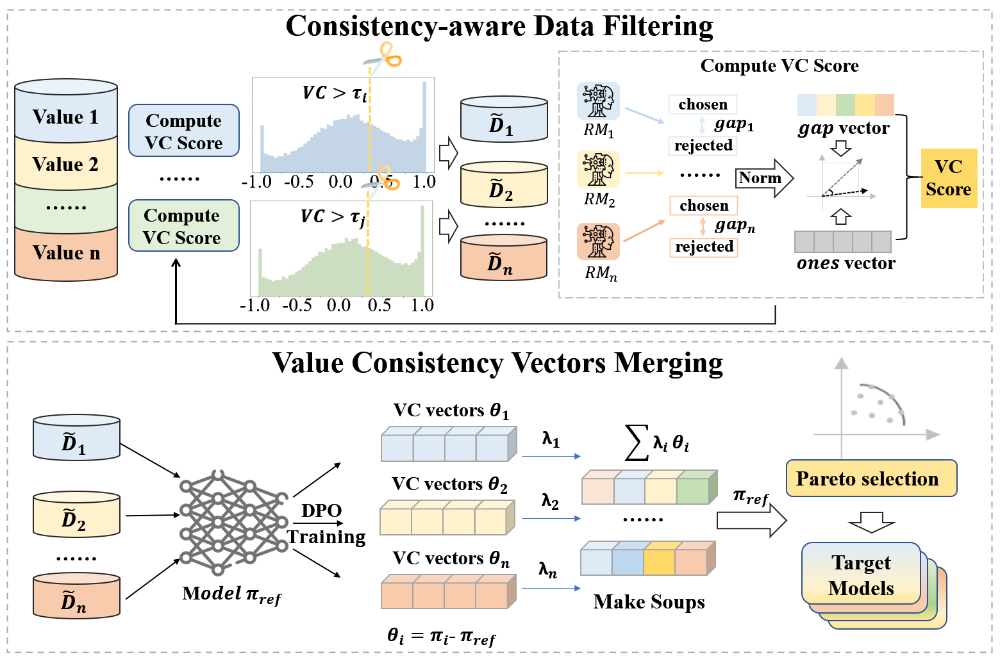

# VC-Soup: Value-Consistency Guided Multi-Value Alignment for Large Language Models

This repository contains partial code and dataset files for **VC-Soup**, a parameter-based method for multi-objective alignment of large language models (LLMs).  
VC-Soup leverages **Value Consistency (VC)** to guide model alignment across multiple human values and utilizes parameter-space model soups to fuse specialized aligned models.

## 📌 Overview

As illustrated in the figure below:  


VC-Soup includes four main stages:

1. **Reward Computation** – Compute reward scores for each value using reward models.  
2. **Normalization & VC Estimation** – Normalize rewards and compute Value Consistency (VC).  
3. **VC-guided DPO Training** – Train value-specific LoRA or full-parameter models with DPO.  
4. **Model Soup Fusion** – Combine value-specific models via parameter-space averaging.

## 📦 Requirements

Before running the pipeline, ensure you have prepared:

- **A pretrained base LLM** (e.g., LLaMA)  
- **Preference datasets** (e.g., HH)  
- **Reward model parameters** (or train it by yourself via preference data)

## 📚 Datasets

HH data is available at: [HH Data](https://huggingface.co/datasets/Anthropic/hh-rlhf)

Beavertails data is available at: [Beavertails Data](https://huggingface.co/datasets/PKU-Alignment/PKU-SafeRLHF-10K)

## 🛠️ Environment Requirements
Python 3.10.16
torch==2.4.0 
torchvision==0.19.0 
transformers==4.45.0 
trl==0.9.6 scipy==1.15.3

## 🚀 How to Run
**1. Compute Reward Scores**

This step loads the dataset and reward models, then computes raw reward scores for each value.
 ```bash
python VC_compting.py
```


**2. Normalize Rewards & Compute VC Scores**

This step normalizes reward scores and computes the Value Consistency (VC) for each data sample

```bash
python VC_Normalization.py
```

**3. Run VC-guided DPO Training**

This step uses VC scores as weights to train value vectors.
```bash
python DPO.py
```

**4. Generate Model Soups**

The final step merge multiple value vectors into a single multi-value aligned model.

```bash
python soup.py
```


